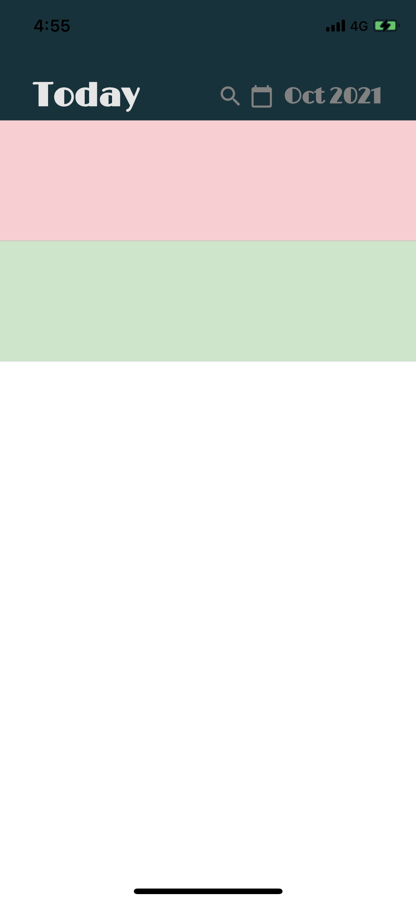
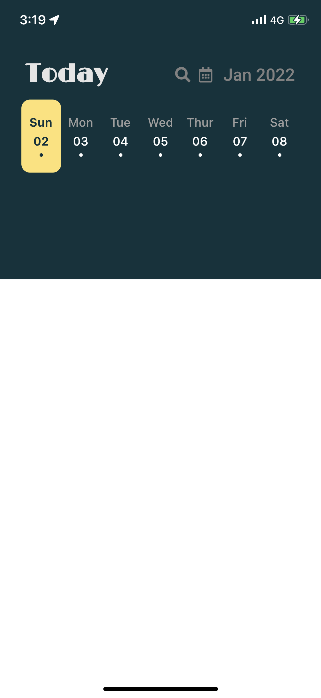
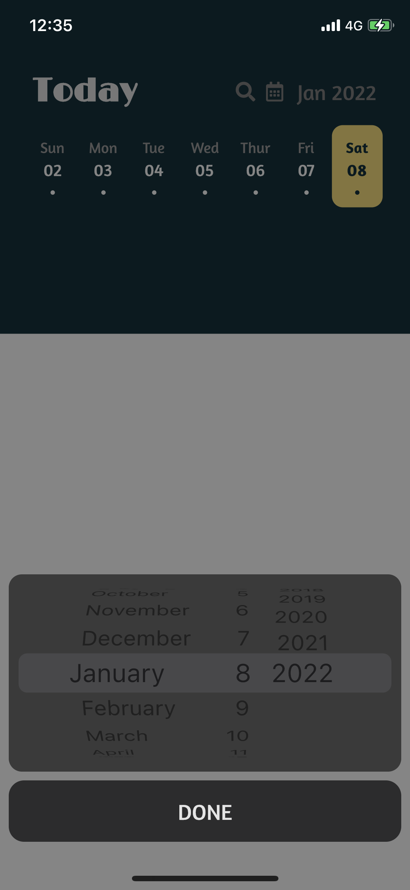
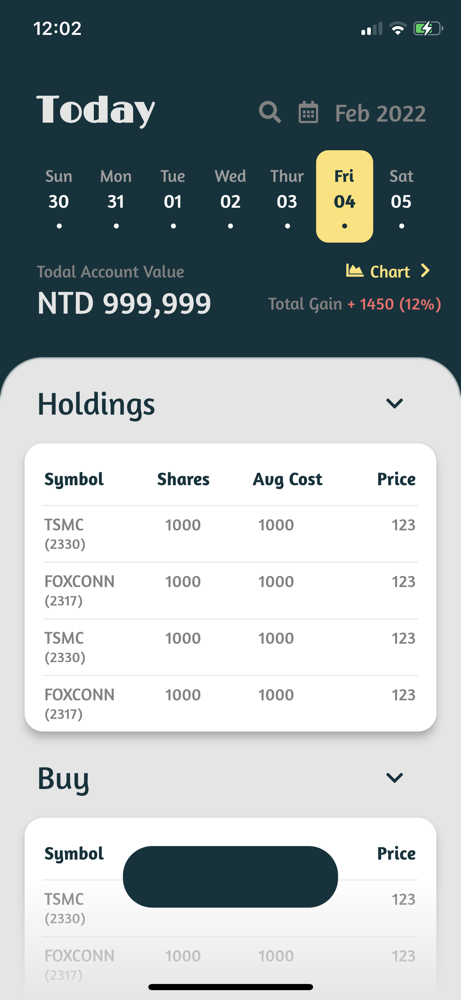

#### Demo

#### Check out my UI prototype on 👉<a href="https://www.figma.com/community/file/1374406881098418305/flutter-daily-track-stock-ui" target="_blank">Figma</a>👈.

#### The process of building this App in a step-by-step manner.

|  |    |   |  |
|---|---|---|---|
|     |    |    |    |
|     |    |    |    | 

